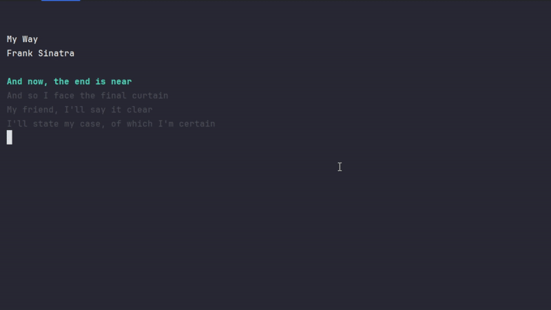

# Lyrics CLI 🎵📟

A simple Python CLI tool for displaying lyrics, movie quotes, or any text with customizable timing and visual effects.

Uma ferramenta CLI simples em Python para exibir letras de música, frases de filme ou qualquer texto com timing personalizável e efeitos visuais.



<h3 align="center">Status: 🚀 Finished</h3>
<p  align="center">
  
  
</p>

# Table of Contents

- [Requirements](#%F0%9F%93%8B-requirements)
- [Installation](#%F0%9F%9B%A0%EF%B8%8F-installation)
- [How to Use](#%F0%9F%93%96-how-to-use)
- [Troubleshooting](#%F0%9F%94%A7-troubleshooting)
- [File Structure](#%F0%9F%93%9D-file-structure)


## 🚀 Features

- **Customizable timing** for each line
- **Visual highlighting** of current line
- **Easy text formatting** with line breaks
- **Cross-platform** support
- **Colorful output** with colorama

## 📋 Requirements

- Python 3.6 or higher
- colorama library

## 🛠️ Installation

### Step 1: Clone or Download

**Option A: Fork this repository**

1. Click the "Fork" button in the top-right corner of this page
2. Clone your forked repository:
```bash
git clone https://github.com/YOUR_USERNAME/lyrics-cli.git
cd lyrics-cli
```

**Option B: Download as ZIP**

1. Click the green "Code" button and select "Download ZIP"
2. Extract the ZIP file to your desired location
3. Open terminal/command prompt in the extracted folder

### Step 2: Install Dependencies

```bash
pip install colorama
```

Or if you're using Python 3 specifically:
```bash
pip3 install colorama
```

## 📖 How to Use

### Step 1: Prepare Your Text

1. Open `lyrics_formatter.py`
2. Replace the example text in the `lyrics` variable with your own text
3. Set your desired `delay` time (in seconds)
4. Run the formatter:

```bash
python lyrics_formatter.py
```

**Example input:**
```python
delay = 2  # 2 seconds delay

lyrics = """
Lorem Ipsum is simply dummy text of 
the printing and typesetting industry.
Lorem has been the industry's standard
dummy text ever since the 1500s
"""
```

**Output:**
```python
("Lorem Ipsum is simply dummy text of ", 2.0),
("the printing and typesetting industry.", 2.0),
("Lorem has been the industry's standard", 2.0),
("dummy text ever since the 1500s", 2.0),
```

### Step 2: Customize Your Display

1. Copy the generated tuples from step 1
2. Open `main.py`
3. Replace the `title`, `description`, and `lyrics` variables
4. Customize individual delays if needed
5. Run the main program:

```bash
python main.py
```

**Example configuration:**
```python
title = "My Song Title"
description = "Artist Name"
lyrics = [
    ("Lorem Ipsum is simply dummy text of ", 2.0),
    ("the printing and typesetting industry.", 2.0),
    ("", 1.0),  # Empty line for spacing
    ("Lorem has been the industry's standard", 2.0),
    ("dummy text ever since the 1500s", 2.0),
]
```

### Step 3: Advanced Features

#### Line Breaks
To add line breaks within a phrase, use `\n`:

```python
lyrics = [
    ("Lorem Ipsum is simply dummy text of \nthe printing and typesetting industry.", 2.0),
]
```

**Console output:**
```
Lorem Ipsum is simply dummy text of 
the printing and typesetting industry.
```

#### Custom Delays
You can set different delays for each line:

```python
lyrics = [
    ("Fast line", 0.5),
    ("Slow line", 3.0),
    ("Medium line", 1.5),
]
```

#### Color Customization
In `main.py`, you can change the colors:

```python
# Current line color (line 7)
highlight = Style.BRIGHT + Fore.CYAN  # Change CYAN to your preferred color

# Background text color (line 6)
bg_text = Fore.LIGHTBLACK_EX  # Change LIGHTBLACK_EX to your preferred color
```

Available colors: `RED`, `GREEN`, `YELLOW`, `BLUE`, `MAGENTA`, `CYAN`, `WHITE`, `LIGHTBLACK_EX`, etc.

## 🎯 Use Cases

- **Song lyrics** with timing
- **Movie quotes** display
- **Poetry** presentation
- **Presentation** text with effects
- **Educational** content display

## 🔧 Troubleshooting

### Common Issues

**Issue:** `ModuleNotFoundError: No module named 'colorama'`
**Solution:** Run `pip install colorama` or `pip3 install colorama`

**Issue:** Colors not showing
**Solution:** Make sure you're running in a terminal that supports colors

**Issue:** Text not displaying properly
**Solution:** Check that your lyrics are properly formatted as tuples

## 📝 File Structure

```
lyrics-cli/
├── main.py              # Main display program
├── lyrics_formatter.py  # Text formatter utility
├── README.md           # This file
└── .gitignore          # Git ignore file
```

## 🤝 Contributing

1. Fork the repository
2. Create a feature branch: `git checkout -b feature-name`
3. Make your changes
4. Commit your changes: `git commit -m "Add some feature"`
5. Push to the branch: `git push origin feature-name`
6. Submit a pull request

---
<h3 align="center">This project was made with ❤️ by Pedro Silva</h3>


